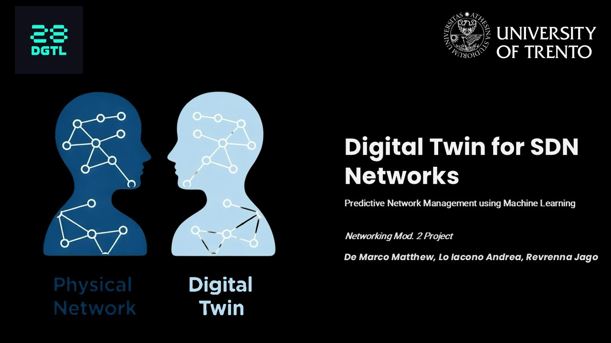

# Digital Twin for Software Defined Networks (DT4SDN)

---
<div align="center">

            

</div>
---

***Prof. <a href="https://webapps.unitn.it/du/it/Persona/PER0003067/Didattica">Granelli Fabrizio</a>***

**Group**: ***<u>De Marco Matthew</u>***, ***<u>Lo Iacono Andrea</u>***, ***<u>Revrenna Jago</u>***


<div align="center">

</div>


<details>
<summary><h2>Table of Contents</h2></summary>

- [Digital Twin for Software Defined Networks (DT4SDN)](#digital-twin-for-software-defined-networks-dt4sdn)
  - [Idea of the Project](#idea-of-the-project)
  - [Architecture Overview](#architecture-overview)
  - [Requirements](#requirements)
    - [Hardware Requirements](#hardware-requirements)
    - [Software Requirements](#software-requirements)
  - [Getting Started](#getting-started)
    - [Option 1: Windows Setup (Vagrant)](#option-1-windows-setup-vagrant)
    - [Option 2: macOS Setup (Multipass)](#option-2-macos-setup-multipass)
  - [Running the System](#running-the-system)
    - [Step 1: Start the Physical Twin](#step-1-start-the-physical-twin)
    - [Step 2: Start the Digital Twin](#step-2-start-the-digital-twin)
    - [Step 3: Generate Traffic](#step-3-generate-traffic)
  - [ML Models](#ml-models)
  - [Project Structure](#project-structure)
  - [API Reference](#api-reference)
  - [Links](#links)
  - [Team Members](#team-members)
  - [Acknowledgments](#acknowledgments)
  - [License](#license)

</details>

<!--=========================================================================-->

## Idea of the Project

---

This project implements a **Digital Twin** for monitoring and predicting traffic behavior in **Software Defined Networks (SDN)**. The system consists of:

1. **Physical Twin (PT)**: A Mininet network with OpenFlow switches controlled by a Ryu controller
2. **Digital Twin (DT)**: A real-time monitoring dashboard with ML-based traffic prediction

The Digital Twin continuously polls the Physical Twin for traffic statistics, stores them in a SQLite database, and uses trained **Seq2Seq LSTM models** to predict future traffic patterns 60 seconds ahead.

**Key Features:**
- Real-time traffic monitoring via web dashboard
- ML-based traffic state classification (NORMAL, ELEVATED, HIGH, CRITICAL)
- Multi-scenario model support (Normal, Burst, Congestion, DDoS, Mixed)
- Live prediction graph visualization
- Scenario-based model switching from UI

<!--=========================================================================-->

## Architecture Overview

---

```
+---------------------------+          REST API          +---------------------------+
|      PHYSICAL TWIN        |  <--------------------->   |       DIGITAL TWIN        |
|---------------------------|                            |---------------------------|
| Mininet Network           |                            | Orchestrator              |
| OpenFlow Switches         |                            | Flask Web Dashboard       |
| Ryu Controller            |                            | SQLite Database           |
|                           |                            | PyTorch ML Models         |
+---------------------------+                            +---------------------------+
     192.168.56.101                                           192.168.56.102
```

<!--=========================================================================-->

## Requirements

---

### Hardware Requirements

- **Host Machine**: Windows 10/11 or macOS
- **RAM**: Minimum 8GB (16GB recommended)
- **CPU**: Multi-core processor with virtualization support
- **Disk**: 30GB free space

### Software Requirements

**Windows:**
- [VirtualBox](https://www.virtualbox.org/wiki/Downloads) 6.1+
- [Vagrant](https://www.vagrantup.com/downloads) 2.3+

**macOS:**
- [Multipass](https://multipass.run/) 1.10+

**Both VMs require:**
- Ubuntu 20.04
- [ComNetsEmu framework](https://git.comnets.net/public-repo/comnetsemu) (official repo)
- Python 3.8+
- PyTorch, Flask, NumPy, Scikit-learn

> [!IMPORTANT]
> For **ComNetsEmu** installation, refer to the **official repository**: https://git.comnets.net/public-repo/comnetsemu . **ComNetsEmu** installation is a fundamental and mandatory step to replicate our work in your machine. **ComNetsEmu** must be installed in both the VMs (the one used for the _Physical Twin_ and the one used for the _Digital Twin_)

<!--=========================================================================-->

## Getting Started

---

### Option 1: Windows Setup (Vagrant)

1. **Install Prerequisites**
   - Install [VirtualBox](https://www.virtualbox.org/wiki/Downloads)
   - Install [Vagrant](https://www.vagrantup.com/downloads)

2. **Clone the Repository**
   ```bash
   git clone https://github.com/MattDema/Networking_DT4SDN.git
   cd Networking_DT4SDN
   ```

3. **Start the Digital Twin VM**
   ```bash
   vagrant up comnetsemu_dt
   ```

4. **SSH into the VM**
   ```bash
   vagrant ssh comnetsemu_dt
   ```

5. **Set up Python environment** (inside VM)
   ```bash
   cd ~/Networking_DT4SDN/setups
   chmod +x setup_vm.sh
   ./setup_vm.sh
   ```

> [!TIP]
> The Vagrantfile automatically installs ComNetsEmu from the [official repo](https://git.comnets.net/public-repo/comnetsemu), clones this repository, and sets up dependencies.

---

### Option 2: macOS Setup (Multipass)

**Creating the VMs:**

```bash
# Physical Twin VM
multipass launch 20.04 --name comnetsemu-vm --cpus 1 --mem 1G --disk 5G

# Digital Twin VM  
multipass launch 20.04 --name digital-twin --cpus 2 --mem 4G --disk 20G
```

**Setting up the Physical Twin:**

```bash
multipass shell comnetsemu-vm
```

1. Install **ComNetsEmu** from the [official repository](https://git.comnets.net/public-repo/comnetsemu)
2. Install dependencies:
   ```bash
   pip3 install requests
   ```
3. Clone the repository:
   ```bash
   git clone https://github.com/MattDema/Networking_DT4SDN.git
   ```

**Setting up the Digital Twin:**

```bash
multipass shell digital-twin
```

1. Install **ComNetsEmu** from the [official repository](https://git.comnets.net/public-repo/comnetsemu)
2. Install dependencies:
   ```bash
   sudo apt update
   sudo apt install python3-pip -y
   sudo pip3 install flask requests numpy scipy joblib torch scikit-learn pandas
   ```
3. Clone the repository:
   ```bash
   git clone https://github.com/MattDema/Networking_DT4SDN.git
   ```

<!--=========================================================================-->

## Running the System

---

### Step 1: Start the Physical Twin

Open **two terminals** in the Physical Twin VM:

**Terminal 1 - Ryu Controller:**
```bash
cd ~/Networking_DT4SDN/setups
chmod +x start_ryu.sh
./setups/start_ryu.sh
```

**Terminal 2 - Mininet Topology:**
```bash
cd ~/Networking_DT4SDN/src/utils
python3 topology_generator.py
# Follow prompts to create network (e.g., 3 switches, 6 hosts, tree topology)
```

---

### Step 2: Start the Digital Twin

1. First, get the Physical Twin IP:
   ```bash
   # On host machine
   multipass list  # or check Vagrant network config
   ```

2. Update the **PT_IP** in the orchestrator:
   ```bash
   cd ~/Networking_DT4SDN/src/controllers
   nano orchestrator.py
   # Change: PT_IP = os.getenv('PT_IP', 'YOUR_PT_IP_HERE')
   ```

3. Also update in `src/web_interface/app.py`

4. Start the Orchestrator:
   ```bash
   cd ~/Networking_DT4SDN
   python3 src/controllers/orchestrator.py
   ```

5. Access the Dashboard at: `http://DT_IP:5000`

---

### Step 3: Generate Traffic

In the Mininet terminal, use iperf to simulate different traffic patterns:

**Normal Traffic:**
```bash
h1 iperf -c 10.0.0.2 -u -b 500K -t 60
```

**Burst Traffic:**
```bash
h1 iperf -c 10.0.0.2 -u -b 25M -t 15 &
```

**Congestion Simulation:**
```bash
h1 iperf -c 10.0.0.2 -u -b 8M -t 90 &
# Wait 20 seconds, then:
h2 iperf -c 10.0.0.3 -u -b 8M -t 70 &
```

**DDoS Simulation:**
```bash
h1 iperf -c 10.0.0.2 -u -b 29M -t 400
```

> [!WARNING]
> Press Ctrl+C to stop traffic and observe the model returning to NORMAL state.

<!--=========================================================================-->

## ML Models

---

The system uses two types of ML models:

| Model Type | Purpose | Architecture |
|------------|---------|--------------|
| **Classifier** | Predict traffic state | BiLSTM |
| **Seq2Seq** | Predict 60s future values | CNN + BiLSTM |

**Available Scenarios:**
- `normal` - Trained on normal traffic patterns
- `burst` - Trained on burst traffic
- `congestion` - Trained on network congestion
- `ddos` - Trained on DDoS attack patterns
- `mixed` - Trained on all scenarios (default)

**Switching Models via UI:**
Use the dropdown in the dashboard header to switch between scenario models in real-time.

**Switching Models via API:**
```bash
curl -X POST http://DT_IP:5000/api/models/switch \
  -H "Content-Type: application/json" \
  -d '{"scenario": "ddos"}'
```

<!--=========================================================================-->

## Project Structure

---

```
Networking_DT4SDN/
├── src/
│   ├── controllers/
│   │   └── orchestrator.py       # Main entry point
│   ├── web_interface/
│   │   └── app.py                # Flask dashboard + API
│   ├── database/
│   │   ├── db_manager.py         # SQLite operations
│   │   └── schema.sql            # Database schema
│   ├── ml_models/
│   │   ├── state_predictor.py    # Classifier model
│   │   ├── seq2seq_predictor.py  # Seq2Seq model
│   │   └── training/             # Training scripts
│   └── utils/
│       └── topology_generator.py # Mininet topology creator
├── models/                       # Trained model files (.pt)
├── setups/
│   ├── start_ryu.sh              # Ryu controller startup
│   └── setup_vm.sh               # VM setup script
├── Vagrantfile                   # Windows VM configuration
└── requirements.txt              # Python dependencies
```

<!--=========================================================================-->

## API Reference

---

| Endpoint | Method | Description |
|----------|--------|-------------|
| `/` | GET | Dashboard HTML page |
| `/api/prediction` | GET | Current traffic prediction |
| `/api/models` | GET | List available models |
| `/api/models/switch` | POST | Switch to different scenario model |
| `/stats` | GET | Database statistics |


<!--=========================================================================-->

## Links

---

- [Presentation PDF](visuals/assets/Presentation/Digital%20Twin%20for%20SDN%20-%20Networking%202%20-%20De%20Marco,%20Lo%20Iacono,%20Revrenna.pdf)

<!--=========================================================================-->

## Team Members

---

- [Matthew De Marco](https://github.com/MattDema) ([matthew.demarco@studenti.unitn.it](mailto:matthew.demarco@studenti.unitn.it))

- [Andrea Lo Iacono](https://github.com/ADreLOI) ([andrea.loiacono@studenti.unitn.it](mailto:andrea.loiacono@studenti.unitn.it))

- [Jago Revrenna](https://github.com/JagoRev) ([jago.revrenna@studenti.unitn.it](mailto:jago.revrenna@studenti.unitn.it))

<!--=========================================================================-->

## Acknowledgments

---

**Networking Module 2 Course** - ***Professor: <a href="https://webapps.unitn.it/du/it/Persona/PER0003067/Didattica">Fabrizio Granelli</a>***


<div align="justify">

   <div style="display: flex; justify-content: space-between; align-items: center;">
      <a href="https://www.granelli-lab.org/" target="_blank">
         
      </a>
      <a href="https://www.unitn.it/" target="_blank">
         
      </a>
   </div>

</div>

<!--=========================================================================-->

## License

---

This project is licensed under the MIT License - see the [LICENSE](LICENSE) file for details.

---

<p align="center">
  <a href="#digital-twin-for-software-defined-networks-dt4sdn" style="text-decoration: none;">
    
    <br>
    <strong>Back to Top</strong>
  </a>
</p>

---